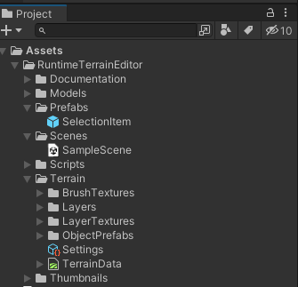
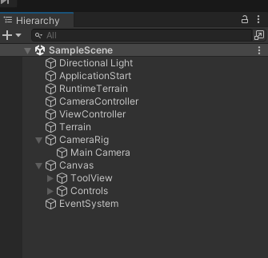
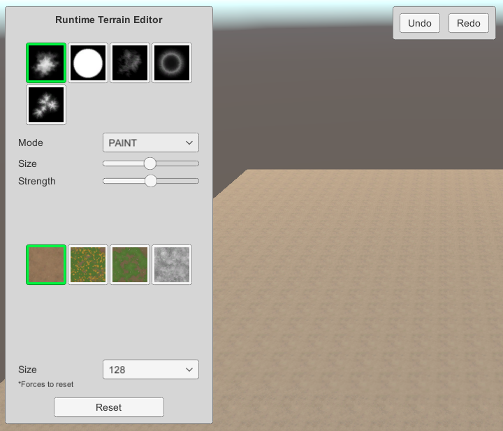
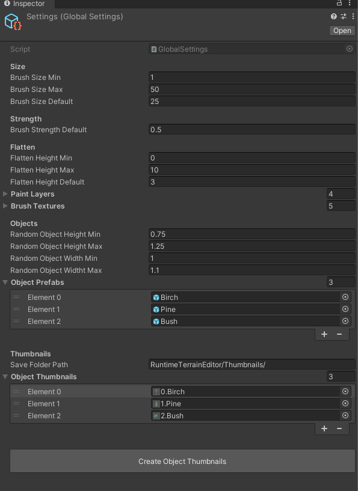
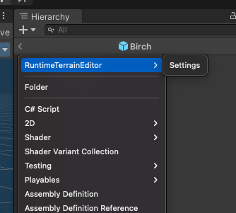
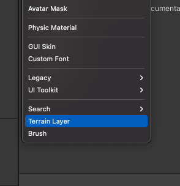
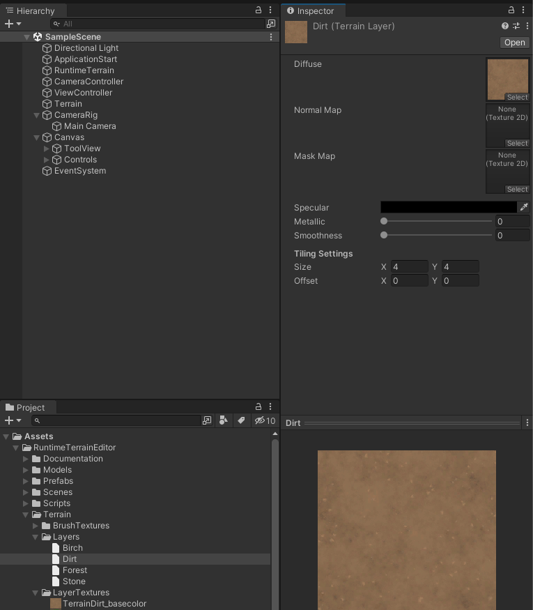

# RUNTIME TERRAIN EDITOR

## Getting Started
Thank you for buying this asset!  
This documentation will explain the project structure and will walkthrough over how to modify and add custom content.  

## Motivation
Unity Terrain is a rapid and powerful tool to create your project scene environment. But it's limited to Unity Editor itself. There is no official solution to use it in runtime/playmode. 

This package aims to utilize the [Unity Terrain API](https://docs.unity3d.com/ScriptReference/Terrain.html) and demonstrate how to make a runtime terrain editor to achive the idea of providing such tools in runtime. 

Also, I used this project as a base to create my own sandbox application, [Map Sandbox](cemuka.itch.io/map-sandbox).

---

`Note: This project uses Legacy Input and Legacy Unity UI components for the sake of simplicity. `

---

## Example Scene Breakdown
This is the project structure  

Open the `ExampleScene` from `Scenes` folder.  

Let's take a look into hierarchy.  

### ApplicationStart
System entry point. Initialize the controllers and `RuntimeTerrain`.

### RuntimeTerrain
Holds reference to target terrain and settings.

### CameraController
Listens for camera movement related inputs.  

Navigate:  
- WASD 
- Arrow Keys 
- Hold Mouse Right Click

Rotate: 
- Q and E (Horizontal)
- Middle Click (Horizontal)
- CTRL + Middle Click (Vetical)

### CameraRig
The parent object for main camera. `CameraController` use it for handling rotation.  

### ViewController
Populates the `ToolView` by settings and default values. Listens ui events and modifies the `RuntimeTerrain` accordingly.
  

  
### ToolView

Holds unity ui object references

### InputController
Listens for terrain modification related inputs and registers the actions to `CommandHistory`:

- CTRL + Z (Undo)
- CTRL + Y (Redo)
- Left click actions(Hold and release)

## Settings
  

Settings is an asset available as ScriptableObject to provide editing functionality. `ViewController` and `RuntimeTerrain` initializes the settings values.

It is also possible to create multiple settings asset in your project. You can create a new settings asset from create menu shown below:  

### Paint Layers
This project uses standart Unity Terrain Layers for paint. This list will be appear in view by order.  

To create a new layer, open Create menu in project panel and click Terrain Layer like shown below:

<!--  -->

### Brush Textures
`RuntimeTerrain` will read grayscale information from the source texture. This list will be appear in view by order.  
 
Any texture resolution could be used since active brush texture will be scaled down or up by current brush size. 

### Object Prefabs
This project uses [TreePrototype](https://docs.unity3d.com/ScriptReference/TreePrototype.html) to register prefabs to Terrain and [TreeInstance](https://docs.unity3d.com/ScriptReference/TreeInstance.html) to place on terrain.  

You can add your custom prefabs to use in editor.  

Note that Unity Terrain requires LOD setup to place any GameObject. This prefabs will appear in `ToolView` in order of this list.  

### Object Thumbnails
Thumbnail textures will be used by prefab index. If no index found, it will appear white color.

To create thumbnails, you can use `Create Object Thumbnails` button. Generated textures will be saved to path provided at settings(`Save Folder Path` field), afterwards they'll be initialized to this list.

## Using the API

`RuntimeTerrain` uses the [`Terrain`](https://docs.unity3d.com/ScriptReference/Terrain.html) and [`TerrainData`](https://docs.unity3d.com/ScriptReference/TerrainData.html) to modify the target terrain. It exposes fields and methods to control from outside.

#### Read-Only Properties
| returns           | property |
| :---              | :--- |
|`BrushEffectMode`  | `BrushEffectMode`|
|`int`              | `BrushSize`|
|`int`              | `BrushIndex`|
|`float`            | `FlattenHeight`|
|`int`              | `PaintLayerIndex`|
|`int`              | `ObjectIndex`|

#### Medhods

`void Init()`  
Initializes the setting values into terrain. 

`void UseBrush()`  
Starts to modify by current `BrushEffectMode`. 

`void SetBrushSize(int value)`  
Shouldn't bigger than actual terrain size.

`void SetBrushStrength(float value)`  
`value` should be between `0.0f` and `1.0f`

`void SetFlattenHeight(float value)`  

`void SetBrushIndex(int index)`  
Set active brush texture by `index` from `Settings.brushTextures`

`void SetPaintLayerIndex(int index)`  
Set active paint layer by `index` from `Settings.paintLayers`

`void SetObjectIndex(int index)`  
Set object prototype by `index` from `Settings.objectPrefabs`

`void SetObjectDensity(float density)`  

`void SetMode(BrushEffectMode mode)`  

`void SetTerrainSize(int size)`  
Use `TerrainSize` enumeration values to get best result.  

Sets the values following: 
- [TerrainData.heightmapResolution](https://docs.unity3d.com/ScriptReference/TerrainData-heightmapResolution.html)
- [TerrainData.alphamapResolution](https://docs.unity3d.com/ScriptReference/TerrainData-alphamapResolution.html)
- [TerrainData.baseMapResolution](https://docs.unity3d.com/ScriptReference/TerrainData-baseMapResolution.html)
- [TerrainData.size](https://docs.unity3d.com/ScriptReference/TerrainData-size.html)

Calls `Reset()` internally

`void Reset()`  
Clears the objects, heights and paint splats with default values.  
Also clears `CommandHistory`.

